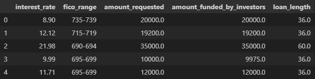
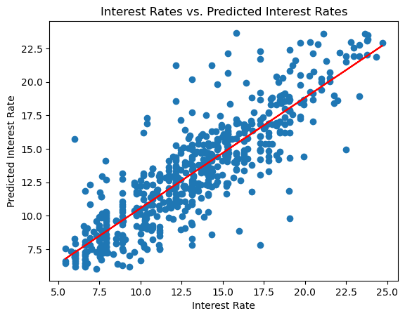

# Interest Rate Analysis

## Background

Our team analyzed a dataset of individual loans, providing information from credit scores to loan amounts and interest rates. We analyzed this in order to understand which loan products offer the most favorable terms. By understanding this, our firm will be able to more effectively market the best possible loans to business owners, beating out the competition.

## Data Overview

## Insights
will most likely delete...

## Model Visualization

This visual representation depicts a linear regression model

## Key Results and Recommendations

