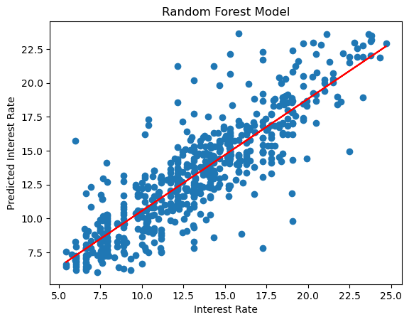
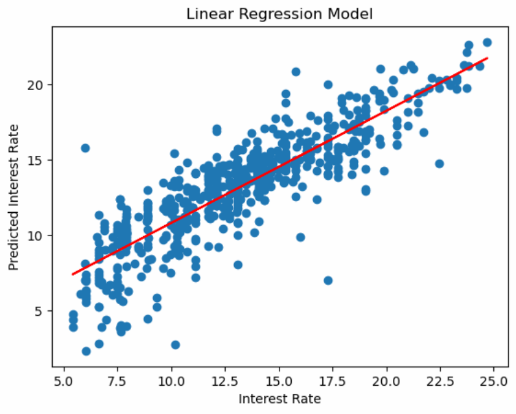
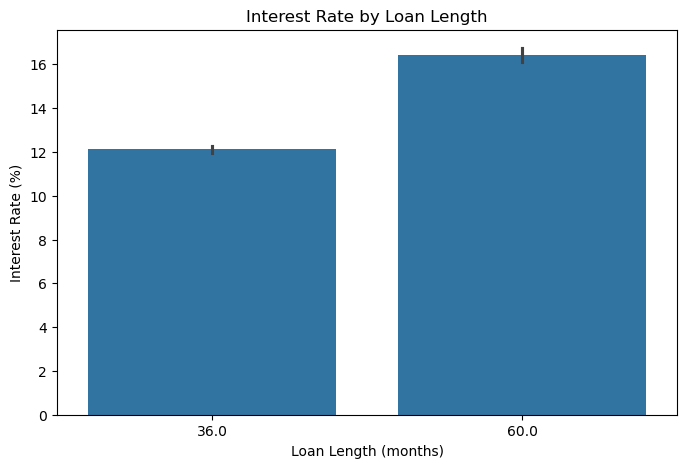

# Interest Rate Analysis

## Background

Our team analyzed a dataset of individual loans, providing information from credit scores to loan amounts and interest rates. We analyzed this in order to understand which loan products offer the most favorable terms. By understanding this, our firm will be able to more effectively market the best possible loans to business owners, beating out the competition.

## Data Overview

## Model Visualization

These visual representations depict two different types of machine learning modeling that we used to predict interest rates based off of our dataset.

<table>
  <tr>
    <td align="center">
         
        <b>Random Forest Model</b>
    </td>
    <td align="center">
         
        <b>Linear Regression Model</b>
    </td>
  </tr>
</table>

## Key Results and Recommendations
Based off of our research and analysis, we've found that the two greatest factors that impact loan rates are **FICO score** and **loan length**.

In order to attract more business owners to open loans with our bank, educating them on these factors will enhance the likelihood of their business.

<table>
  <tr>
    <td align="center">
         
        <b>Interest Rates vs. FICO Score</b>
    </td>
    <td align="center">
         
        <b>Interest Rates vs. Loan Length</b>
    </td>
  </tr>
</table>